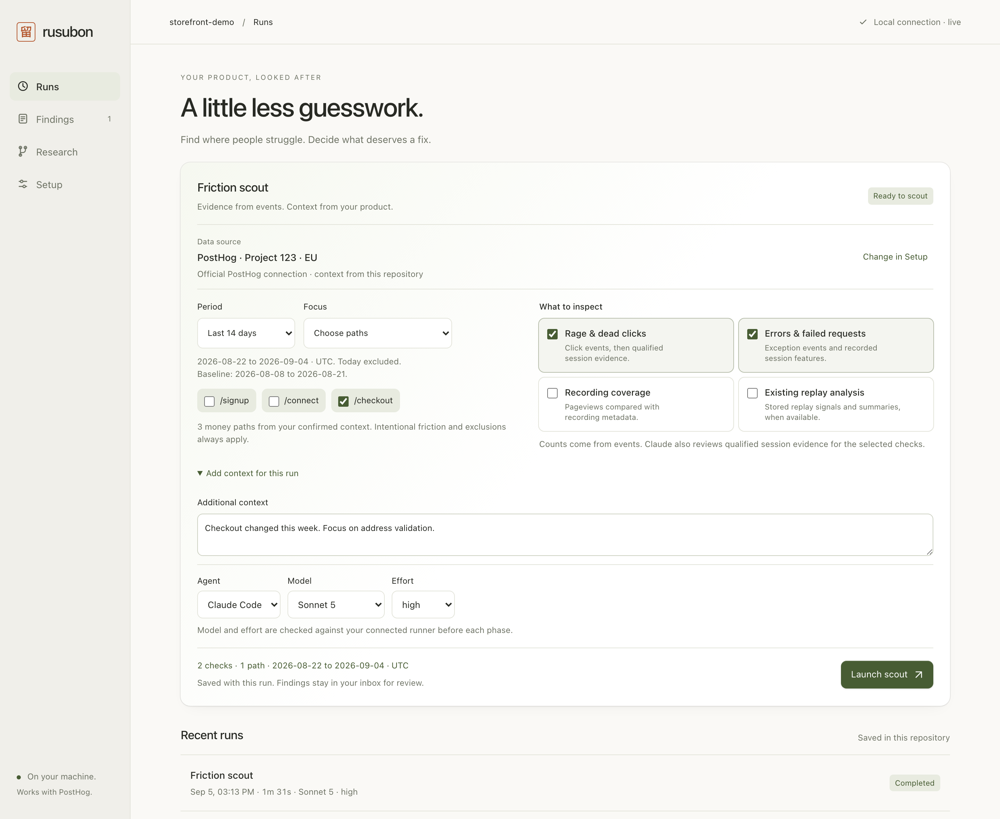
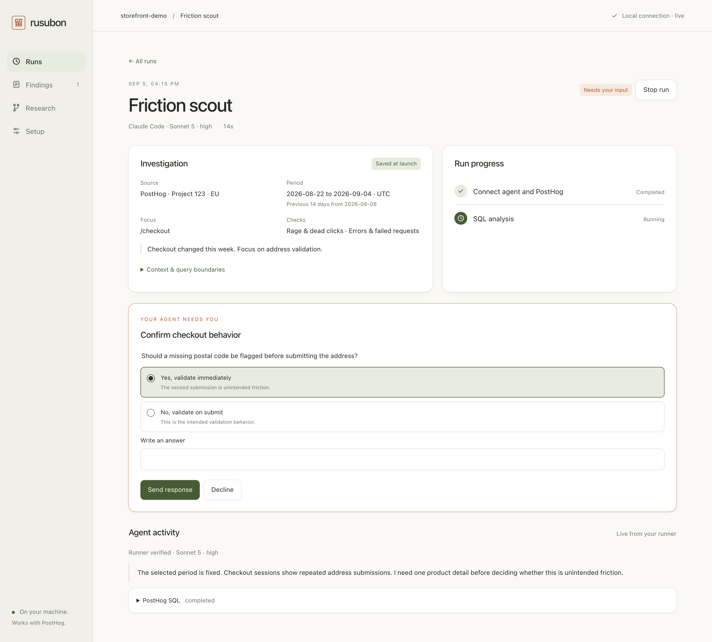
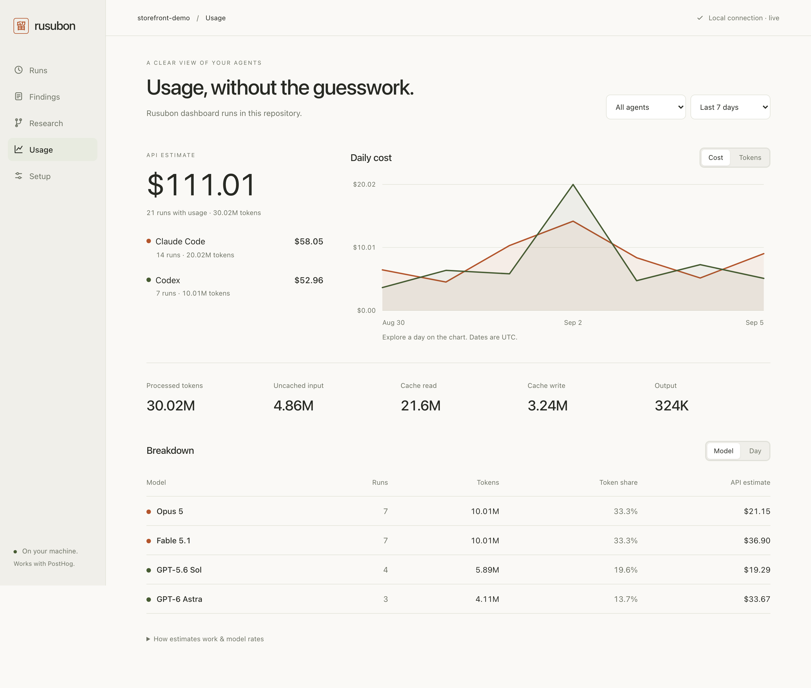

# Rusubon

**留守番.** The one who watches the house while you're out.

PostHog already recorded the sessions. You already pay for Claude, Cursor, or Codex.
Rusubon runs a scout on that login, through official PostHog MCP, and writes friction findings as markdown in your product repo.

Early preview, version 0.1.0. Install from source below. The dashboard supports Claude Code and Codex; Cursor is CLI-only. See the [changelog](CHANGELOG.md) for release status.

**Install with your agent:**

```text
Read https://raw.githubusercontent.com/VXNCXNX/Rusubon/main/SETUP-AGENT.md and set up Rusubon for this product repository.
```

**Choose what to investigate, then launch with one click. Follow the evidence and your agent's progress in one place.**



*Screenshots use a demo workspace with illustrative data.*

## Start your dashboard

You need Node.js 22.12 or newer, npm, Git, and an installed Claude Code or
Codex CLI available in your terminal. Use macOS, Linux, or Windows through WSL.
Your PostHog Cloud project must already receive product events. Recording and
replay checks also need the corresponding data in PostHog.

Install Rusubon once from this repository:

```bash
git clone https://github.com/VXNCXNX/rusubon.git
cd rusubon
npm ci
npm link
```

Open the dashboard for the **product repository you want to investigate**.
Replace the example path with the actual folder containing your product's code:

```bash
rusubon ui --repo /absolute/path/to/your-product
```

A local browser page opens. Keep this terminal running. There is no frontend
build, separate web server, or hosted Rusubon account to set up.

1. Open **Setup**. Sign in to Claude Code or Codex if needed, then choose **Connect PostHog** for that runner and complete authorization in your browser.
2. Enter your PostHog project ID and US or EU region. Add product context, including actual URLs or paths under `# Money paths`, intentional friction, and exclusions. Confirm the context and click **Save setup**. This initializes Rusubon's files in your product repository.
3. Open **Runs**. Choose the period, money paths, checks, and any additional context. Select your agent, model, and effort, then click **Launch scout**.
4. Follow progress and answer agent questions on the run page. Open **Findings** to review the evidence. **Research** holds the separate spec creator and implementation settings for a human-launched draft PR.

Next time, open a terminal in that product repository and run:

```bash
rusubon ui
```

The default port is chosen automatically. The command prints the exact URL to
open if the browser does not appear. Closing the browser leaves a run active;
**Stop run** stops that run, and Ctrl-C in the terminal stops the dashboard and
its active workers. Your setup, findings, and run history remain on disk.

### If you get stuck

| Symptom | What to do |
| --- | --- |
| `rusubon: command not found`, or `npm link` cannot write to the global bin directory | Use `node /absolute/path/to/rusubon/bin/rusubon.mjs ui --repo /absolute/path/to/your-product`. Keep the Rusubon clone and its installed dependencies. |
| The wrong repository appears | Stop the dashboard and restart with `--repo` pointing to your product's code. The repository path is shown in Setup. |
| The browser did not open, or an old tab says it is disconnected | Open the full URL printed by the currently running command, including its token fragment. A restart creates a new URL token. |
| A runner is missing or cannot sign in | Check that `claude` or `codex` works in the terminal that launches Rusubon. Install or sign in to that CLI, then refresh connections in Setup. |
| Launch scout is disabled | Read the message beside the button. Confirm context, choose at least one money path and check, connect PostHog, and select an available model and effort. |
| No findings appear | Read the run's close-out. Missing optional data and evidence below the filing threshold can produce no findings. |

For a fixed local address, use `rusubon ui --port 4242`. For another product,
start another dashboard with its own `--repo`; each repository has its own setup
and history. Only one dashboard can own a given repository at a time.

## Local dashboard

```bash
rusubon ui                              # current product repo, opens your browser
rusubon ui --repo /path/to/product      # select a product repo
rusubon ui --port 4242 --no-open         # print the URL without opening it
```

**Follow each phase and answer your agent's questions directly in the dashboard.**



The dashboard binds to `127.0.0.1`. Use the full URL printed by the command. Its
fragment contains the session token, which the browser keeps in session storage.
Keep the terminal running while you use the dashboard.

In Setup, sign in to Claude Code or Codex with the installed CLI. Connect the
official PostHog MCP on each runner you want to use. Authorization opens in your
browser. Credentials stay in the runner's configuration. Rusubon does not ask
you to paste an API key into the dashboard. Existing API-key environments still
use their configured billing, shown on the connection card.

Set the PostHog project ID and region, then edit product context. Check the
confirmation box only after reviewing money paths and intentional friction.
You can save an unconfirmed draft and have the agent propose context. The
placeholder stays until you confirm and save it.

Setup saves compare the revision of both configuration and context files. If
either changed while the form was open, your edits stay in the form and the
save is refused. View the current setup, then load it and reconcile your edits.

In Runs, choose the PostHog project in Setup, then set the investigation:

| Choice | What it controls |
| --- | --- |
| Period | Last 7, 14, or 30 complete UTC days, or custom dates up to 90 days. The previous period has the same duration. Today is excluded. |
| Focus | All confirmed money paths or a subset. Put URLs or paths such as `/checkout` under `# Money paths` in product context. Descendants, `:id` segments, and explicit `*` segments are supported. |
| What to inspect | Rage/dead clicks, errors/failed requests, recording coverage, and existing replay analysis. At least one check is required. |
| Additional context | A note for this run, such as a recent release or behavior to investigate. Confirmed intentional friction and exclusions still apply. |

Click checks query `$rageclick` and `$dead_click` events. Error checks use
`$exception` events and recorded failure counters. Coverage compares pageviews
with recording metadata. Existing replay analysis reads `$recording_observed`
signals and available stored summaries; it never creates scanners or summaries.
All checks use traffic for context. Missing optional evidence is recorded as a
limitation. Coverage and replay checks may read at least 30 days of diagnostic
history, shown before launch. Findings and session candidates stay within the
chosen period and focus.

The project, UTC bounds, paths, checks, and confirmed context are saved in
`scout-scope.json` and shown on the run. Both phases receive that snapshot.
The harness rejects candidates with a different scope ID, dates outside the
period, unrelated paths, or disabled signals before session review. Review &
rerun loads the previous choices for inspection; relative dates move forward,
while custom dates stay fixed. The browser remembers your choices. Save setup
to persist them in `rusubon.json` under `scout`, which the CLI also honors.
CLI configurations without `scout` retain the existing scout defaults.

Choose the scout's agent, model, and effort in Runs. Research has independent
controls for the spec creator and implementation. Save setup to persist all
three agent defaults.
The spec creator handles research, requirements, design, and tasks. It defaults
to GPT-5.6 Sol at `high` effort. Implementation starts a separate agent phase
from the validated spec, using its own selection. The installed runner's live
catalog must support the selection before a phase can start. The dashboard's
allowlist is deliberately small:

| Agent | Model | Allowed effort levels |
| --- | --- | --- |
| Claude Code | Sonnet 5 | `low`, `medium`, `high`, `xhigh`, `max` |
| Claude Code | Opus 5 | `low`, `medium`, `high`, `xhigh`, `max` |
| Claude Code | Fable 5.1, spec creator only | `low`, `medium`, `high`, `xhigh`, `max` |
| Codex | GPT-5.6 Luna | `low`, `medium`, `high`, `xhigh`, `max` |
| Codex | GPT-5.6 Terra | `low`, `medium`, `high`, `xhigh`, `max`, `ultra` |
| Codex | GPT-5.6 Sol | `low`, `medium`, `high`, `xhigh`, `max`, `ultra` |
| Codex | GPT-6 Astra | `low`, `medium`, `high`, `xhigh`, `max`, `ultra` |

Live capabilities can narrow these choices. `ultra` is a mode of the connected
Codex runner that enables automatic delegation, not a portable API effort
value. Fable 5.1 (`claude-fable-5-1`) is opt-in for research/spec creation only;
it is excluded from scouting, session review, and implementation. Fable 5 stays
excluded. Each PR run records both phase selections and reuses them on Run again.
Reported Claude model switches and effort mismatches stop the phase. Runtime
hooks verify applied effort when the initial message omits it; a phase without
effective model and effort evidence is not accepted as successful.
Claude's session-review phase uses the separately saved Sonnet 5 or
Opus 5 model at `low`; Codex scouts stop after SQL analysis.

In `rusubon.json`, the top-level `runner`, `model`, and `effort` configure the
scout. The `spec` and `implementation` objects each accept their own `runner`,
`model`, and `effort`. The CLI PR workflow honors both objects. Existing CLI
configurations without these objects keep using the top-level selection.

### Agent permissions

Permissions default to **Auto** for Claude Code and Codex, including CLI
runs and existing configs without a permission setting. Change the mode in
**Setup → Agent permissions**, or set `"permissionMode": "auto"` at the top level
of `rusubon.json`.

| Mode | Behavior |
| --- | --- |
| Auto (default) | The runner reviews tool actions automatically. Routine permissions need no clicks; some actions can still be blocked or require input. Codex keeps its workspace sandbox. |
| Ask | Review permission requests in the dashboard. Headless CLI runs can deny actions that require approval. |
| YOLO | Bypasses tool permission checks. Codex also runs with full filesystem and network access. |

Auto uses Claude Code's `auto` permission mode and Codex's `--approve-for-me`
CLI flag or `auto_review` dashboard reviewer. YOLO uses Claude's
`bypassPermissions` and Codex's approval/sandbox
bypass. Use current runner versions that support these modes. Product questions
and sign-in still need you. Saving applies to future runs, including reruns;
each dashboard run records its mode at launch. This setting covers scouts,
context drafts, and both research phases. Cursor keeps its existing CLI behavior.

Follow phases, agent messages, tool activity, usage, and saved artifacts from a
run's page. Answer permission prompts and agent questions there. Refreshing or
closing the browser does not stop the run. Stop run, or Ctrl-C in the dashboard
terminal, stops its processes and preserves partial files. After an interrupted
server restart, the history marks unfinished runs as failed. Run again starts a
fresh run; it does not resume the old agent session. One writable operation can
run per repository, shared with CLI scouts and PR workflows.

A durable guard blocks scouting during context drafting and after a dashboard
crash. The supervisor waits for the draft's processes to stop, restores the
review placeholder, then clears the guard. Recovered drafts require human review.

Findings displays the report's evidence and HogQL. Decline archives a finding
and saves your reason to memory. Research & create draft PR explicitly launches
the existing research, spec, implementation, verification, and publishing flow.
It creates a worktree under `~/.rusubon/worktrees/` from the current committed
HEAD. That base must match origin, and the Rusubon ignore rules must be committed.
Uncommitted edits in your original checkout stay there. Successful publishing
opens the draft PR for review. Failed worktrees and their artifacts stay available.

The frontend uses local static assets with no build step. Its Node server talks
to the installed Claude Code CLI through the Claude Agent SDK and to Codex
through its stdio app-server protocol. It does not require an ACP bridge.

### Usage

Open **Usage** to see daily cost and token charts, Claude Code / Codex totals,
and a breakdown by model or day. Filter by agent and the last 7, 30, or 90 days.
The section reads saved dashboard runs from the current product repository.
It does not scan your machine's other agent sessions or terminal-only CLI runs.

<details>
<summary>See the Usage dashboard</summary>



</details>

Dollar amounts are **API estimates**, not subscription charges. Claude's reported
per-model costs include delegated work when the runner provides it. Codex uses
recorded token counters and Standard API rates. Cumulative updates count once;
reasoning tokens are already part of output. Input, cache reads, cache writes,
and output have separate totals. Dates use UTC; Claude usage appears when each
phase reports its result. Stopped runs keep whatever usage was recorded.

The bundled catalog includes Fable 5.1 and GPT-6 Astra, checked against
[Claude pricing](https://platform.claude.com/docs/en/about-claude/pricing) and
[OpenAI model pricing](https://developers.openai.com/api/docs/models/gpt-6-astra)
on September 5, 2026. Astra has a separate cache-write rate. Codex estimates
account for the higher rate above 272K input tokens when the request counters
are available. Missing prices, unknown Claude cache-write durations, and
incomplete history are shown explicitly. Fast mode, tool fees, and provider
discounts can differ from the catalog estimate.

Expand **How estimates work & model rates** to inspect the source or save rates
for a model seen in your runs. Overrides live in `.rusubon/usage-rates.json`,
stay local, and apply when the runner has no reliable cost. Reset restores the
catalog. Updating rates recalculates historical estimates.

The Codex token normalization adapts a small part of
[ccusage](https://github.com/ccusage/ccusage) under its MIT license. Attribution
is in `NOTICE` and `LICENSE-ccusage-MIT`; no global transcript scan is needed.

## Use the CLI directly

A finding is a file containing the affected path, a quantified change, and
supporting queries. Review it with `show`, or archive noise with `decline --why`
so future scouts can use that decision. Friction never opens a PR or a GitHub
issue. A person can launch `rusubon pr` after reviewing a report.

If you prefer terminal setup, run this inside your product repository:

```bash
rusubon init
```

That writes `rusubon.json`, `.rusubon/context.md` (you fill this), `.rusubon/memory/`, and gitignores `.rusubon/inbox/` + `.rusubon/runs/`. It does not write `.mcp.json`.

Fill `.rusubon/context.md` (product, money paths, intentional friction, out of scope) and set `posthog.projectId` in `rusubon.json`. Or propose a first pass:

```bash
rusubon context draft --about "…"
```

That writes guesses (marked as guessed) and **keeps** the placeholder. Edit the money paths. Delete the comment. `rusubon doctor` still refuses until you do. `rusubon doctor` also checks runner login and official PostHog MCP.

Log into the runner (`claude` by default). Point it at the official PostHog MCP: copy `rusubon.mcp.example.json` into Claude/Cursor MCP config, or:

```bash
npx @posthog/wizard mcp add
```

The PostHog key lives in the runner's config, never in the repo.

```bash
rusubon doctor
rusubon run friction
rusubon inbox
rusubon show <slug>
rusubon decline <slug> --why "intentional EU checkout gate"
rusubon remember pattern/capture-baseline still quiet week of …
rusubon pr <slug>
```

`run` on Claude is two passes: SQL first (capture, Vision, rage concentration), then a low-effort read of sessions that hit a money path *and* a cheap signal (rage, dead click, exception, Vision tag). Sub-agents scan those ids in parallel. The parent writes 0–3 reports. A report is a quantified title, a step vs that path's baseline, and a Series table of numbers already queried. Cap 100 sessions or 45 minutes. Cursor and Codex stop after SQL.

`run` ends with a harness block (duration, `mcp=ok|missing`, reports, memory writes, close-out) and the inbox. Read a finding with `show`. Archive it with `decline --why`.

## Layout (after init)

```
rusubon.json                       # committed: projectId + host (us|eu) + runner
.rusubon/context.md                # committed: you write this
.rusubon/memory/<prefix>/<slug>.md # committed: scout + decline why
.rusubon/inbox/reports/*.md        # gitignored: open findings
.rusubon/inbox/archive/*.md        # gitignored: declined
.rusubon/runs/*.md                 # gitignored: close-outs
.rusubon/runs/*-friction-candidates.json # gitignored: phase-two session candidates
.rusubon/runs/<run-id>/            # gitignored: PR prompts, results, logs, receipt and close-out
.rusubon/runs/ui-<uuid>/           # gitignored: dashboard job, events, scout artifacts
.rusubon/runs/*.lock              # gitignored: local dashboard and workflow ownership
```

## Config

`rusubon.json`:

```json
{
  "posthog": { "projectId": "YOUR_PROJECT_ID", "host": "YOUR_REGION" },
  "runner": "claude",
  "read": { "effort": "low" }
}
```

`host` is `us` or `eu` (or `https://us.posthog.com` / `https://eu.posthog.com`). Match the region the project lives in. There is no default.

`read.effort` / `read.model` apply to the session-read pass only (Claude). Omit `read.model` to keep the CLI default model.

| `runner` | What it uses | Bills |
| --- | --- | --- |
| `claude` | Claude Code CLI / Agent SDK | Claude Pro/Max if `ANTHROPIC_API_KEY` is **unset** |
| `cursor` | Cursor CLI / `@cursor/sdk` | `CURSOR_API_KEY` |
| `codex` | Codex CLI / SDK | ChatGPT login, or API key |

Each person runs Rusubon on their machine, with their login. Do not proxy someone else's subscription.

If the runner session has no official PostHog MCP tools, the skill writes a close-out that starts with `no PostHog tools` and emits nothing.

## Skills

`friction` is the scout. After a report, a human can launch `rusubon pr`. Friction never opens a PR.

| Skill | Job |
| --- | --- |
| `friction` | Capture cliffs + money-path clusters. Findings are `requires_human_input`. Launch with `rusubon run friction`. |
| `research` | Human-launched via `rusubon pr <slug|#N|url>`. Draft PR only. Never merge. |
| `spec` | Auto-mode requirements, design and tasks between actionable research and implementation. |

`rusubon pr <slug>` runs research, then spec, implementation and verification,
then a draft PR. The bundled spec adapts [VXNCXNX/spec-skill](https://github.com/VXNCXNX/spec-skill)
for unattended execution: the agent selects recommended options from repo evidence
and records the options, choice and reason in a decision ledger. It does not
pause for spec approval or question rounds. Existing user choices take precedence.

Launch from a clean checkout root on the published branch you want the PR to
target. Its HEAD must match `origin` so unrelated local commits cannot enter the
PR. Research writes a spec in `docs/plans/YYYY-MM-DD-<source-slug>-<run-id>/`. The harness
validates it before starting a separate implementation phase on a unique branch.
Requirements, design, decisions and commands stay fixed after that gate. Only
declared files, task checkboxes and completion state may change.

The harness then executes every verification command, requiring passing TAP test
cases and valid plans, including nested subtests. Incomplete or malformed TAP
stops publishing. Zero-case plans and entirely skipped suites do not count. Test commands
must use the project's TAP reporter; ordinary lint/build checks use exit status.
Each command gets two minutes. Each runner phase gets 30 minutes. Commands run
with argv arrays and a repo-relative working directory, without shell expansion.
Node's default TAP reporter represents an empty test file as a passing test.
TAP alone cannot distinguish that wrapper from a real test with the same name;
verification does not certify that the reported cases contain assertions.

Run artifacts live in `.rusubon/runs/<run-id>/`: phase results, prompts, logs,
verification receipt and `close-out.md`. The receipt binds the exact spec and
non-ignored code contents to the checks that ran. After rechecking that evidence,
the harness commits, pushes and creates a draft PR, then opens it for review.
Submodules are recorded by their checked-out commit, or their indexed commit
when uninitialized. Uncommitted changes inside submodules stop the run.
The runner never owns publishing. These checks govern the harness workflow;
they are not a sandbox around the user's runner or proof that test assertions
capture every requirement.

Routine implementation alternatives are resolved automatically. Missing evidence,
conflicting requirements or missing authorization produce a `requires_human_input`
close-out without a PR. The scout still only writes findings; a person launches
the research-to-PR flow. Auto mode never merges or deploys. Failed runs preserve
their branch and files for review; they never reset or discard work. Before a
fresh run, commit the work you want to keep or use a clean worktree.

## What this is not

- A PostHog Cloud feature, or a fork you self-host
- A standing Replay Vision / Gemini scanner
- An unattended PR publisher. A person launches each research-to-PR run. No cron or auto-merge.
- A hosted AI reseller

## License

Apache-2.0 for Rusubon. Adapted scout text: PostHog Inc., MIT. See `NOTICE` and `LICENSE-PostHog-MIT`.
